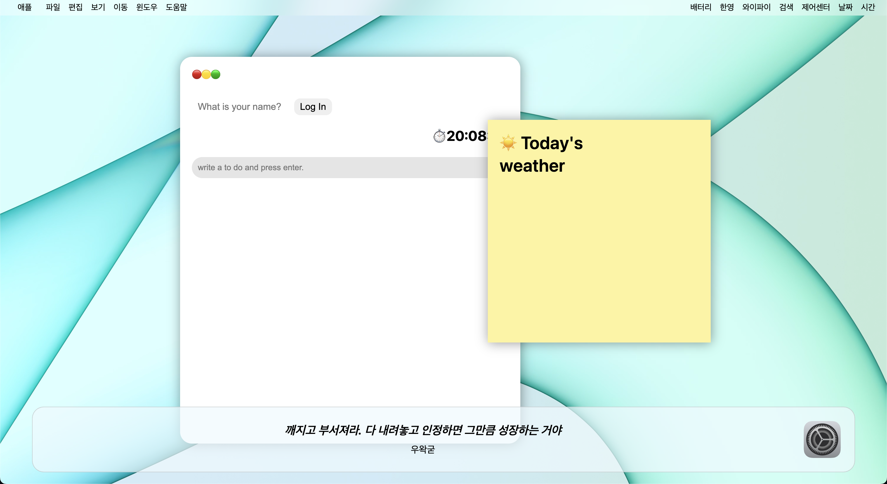

# ToDoList-Clone

## 🔗 Demo
https://jonghwa3471.github.io/study-js-toDoList-clone/

## 🖥 Preview

## 🔥 Stack

### Front-end

   

## ✅ Packages

- [x] HTML5
- [x] CSS3
- [x] JavaScript
- [x] VSCode
- [x] GitHub

## 📖 Theory

- [x] getElementById
- [x] querySelector
- [x] addEventListener
- [x] appendChild
- [x] localStorage
- [x] fetch weather api

## 📱 View

- [x] ToDoList
- [x] Weather
- [x] Clock
- [x] Quotes
